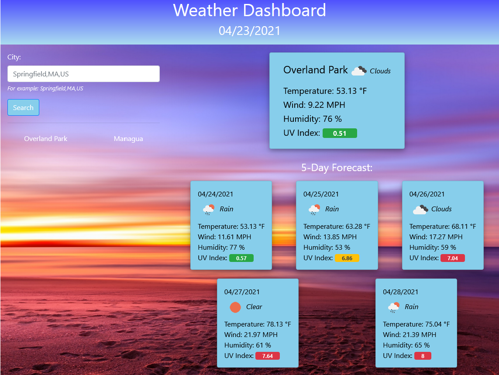

# 06 Server-Side APIs: Weather Dashboard

## Task

Build a weather dashboard that will run in the browser and use the [OpenWeather One Call API](https://openweathermap.org/api/one-call-api) to retrieve weather data for cities. The application will render data using HTML generated dynamically and will use `localStorage` to store persistent data.

## User Story

```
AS A traveler
I WANT to see the weather outlook for multiple cities
SO THAT I can plan a trip accordingly
```

## Acceptance Criteria

```
GIVEN a weather dashboard with form inputs
WHEN I search for a city
THEN I am presented with current and future conditions for that city and that city is added to the search history
WHEN I view current weather conditions for that city
THEN I am presented with the city name, the date, an icon representation of weather conditions, the temperature, the humidity, the wind speed, and the UV index
WHEN I view the UV index
THEN I am presented with a color that indicates whether the conditions are favorable, moderate, or severe
WHEN I view future weather conditions for that city
THEN I am presented with a 5-day forecast that displays the date, an icon representation of weather conditions, the temperature, the wind speed, and the humidity
WHEN I click on a city in the search history
THEN I am again presented with current and future conditions for that city
```

## Mock-Up

The following image shows the web application's appearance and functionality:


## Completed Work



URL of the deployed application:

https://japinell.github.io/KU-CBC-Homework-6-Weather-Dashboard/

URL of the GitHub repository:

https://github.com/japinell/KU-CBC-Homework-6-Weather-Dashboard

## How to Use the Application

The application provides an input field and a button to allow the user to search for weather information by city name. By default, the application loads information for the city of Overland Park, KS, USA.

Past searches are stored in localStorage; the application stores the city name and its latitude and longitude. These data are rendered when the application loads allowing the user to search for updated weather information.

Weather information is displayed using visual elements like cards, icons, and imperial unit of measurement, a similar system to the one currently used in the USA.

## Implementation Details

When the application loads, it searches for a JSON object of last cities saved to localStorage.

> If cities are found, the application retrieves the city name, the latitude, and the longitude of the first of these cities, and uses that data to call the `OpenWeather One Call API` to retrieve current weather and forecast for that city by passing its _latitude_, _longitude_, and an _API key_ along with other query parameters to return only the datasets needed (_current_ weather and _daily_ forecast).

> If no cities are found, the application searches for the latitude and longitude coordinates for Overland Park using the `Weather API`, and then, the `OpenWeather One Call API` as described above.

The API server and corresponding end points for Weather and One Call APIs are defined as global parameters to the application.

Data retrieved from these API calls are stored in an object holding the date, city name, latitude, longitude, weather icon (URL), weather description, temperature, wind, humidity, UV index, and an array containing the forecast for the next five days.

Next, these data are used to render the Weather Dashboard dynamically by using `jQuery` and `Bootstrap` and `CSS` classes.

The application was built with a mobile-first mindset. It is **responsive** to small, medium, large, and extra-large screen sizes. Cards are rearranged for display according to the screen size.

## Technologies Used to Complete the Task

The following technologies for web development were used to build the application:

### HTML (20%)

To build the general structure of the application

### CSS (4%)

`Bootstrap`, custom `CSS`, and `OpenWeather Icons` to style the application elements

### JavaScript (76%)

`jQuery` for dynamically rendering the weather dashboard elements, and reading and writing data from/to them. It also uses `DayJS` to parse, validate, manipulate, and display dates and times. Cards are manipulated with JQuery and styled with `Bootstrap` and `CSS` when/after they are created.

The application uses an array of objects to store data for the last cities searched, an object to store weather and forecast data, functions to render the data, and helper functions to read and write from/to localStorage to persist the cities as a `JSON` object, handle the user interaction, and style the dashboard.
